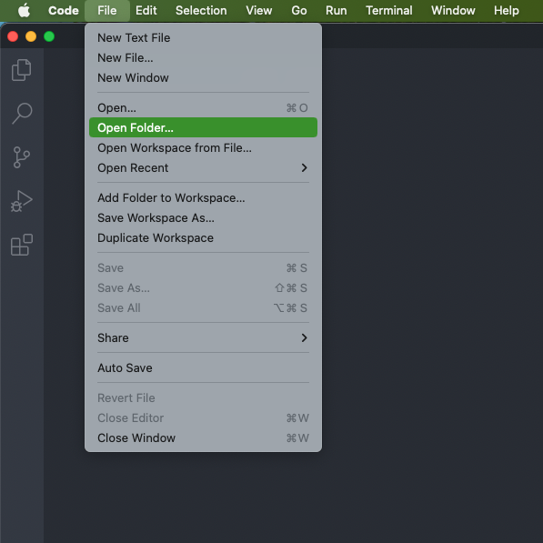
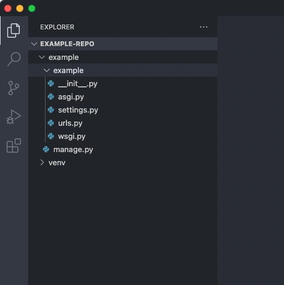

###########################
Getting Started with Django
###########################

************
Introduction
************

**Django** is a web framework written in Python.
It provides us with pre-written functionality for convenience
but which can also be customised.
For example, when we start a project with Django, there's already to the ability to perform
authentication - i.e. so users can login and logout to our app.
This means that we do not have to build our app totally from scratch but rather build upon
the basic "skeleton" Django gives us.

*****
Setup
*****

Before we dive in, we need to make sure we are in the correct folder in our computer.
When we start a Django project, it is going to create multiple files and folders for us.
Of course, we want our project to be in a relevant place in our computer.
This top-level folder will be referred to the repo directory in this guide.

#. Create a folder named `example-repo` in a relevant place in your computer

#. Launch the VS Code text editor

#. Open the folder we just created in VS Code

************
Installation
************

#.  In your command line, use the following command to install Django:

    .. code-block:: console

      pip install Django

#.  Verify that it has been installed by running the following in the command line:

    .. code-block:: console

      pip freeze

    It should be listed in the resulting output:

    .. code-block:: console
      :emphasize-lines: 3

      asgiref==3.6.0
      backports.zoneinfo==0.2.1
      Django==4.2.1
      sqlparse==0.4.4

.. note::
  When getting started with web development (or any programming project for that matter),
  we need to make a distinction between commands for the command-line versus code
  written in our text editor.

  For installing Python packages and running Python modules, we do this with the
  command line: either with the intergrated terminal in VS Code or a separate window.
  When writing the Python code itself, we do this in our Python modules
  (files with the .py extension).
  
  If we were to run the above command in a Python module it would not work.
  Always make sure what language a code snippet is since that will determine where it
  should be entered.

**********************
Starting a New Project
**********************

#.  In your command line, use the following command to start a Django project.
    We use the ``django-admin`` command provided by Django with the ``startproject``
    subcommand followed by the name of our project, which in this case is called `example`:

    .. code-block:: console

      django-admin startproject example

This will create all the default files and folders, that automatically incorporate the
project name we passed to it - i.e. `example`.

You should be able to see this directory structure in the VS Code explorer pane.

***********************************
Understanding the Project Structure
***********************************

At first, it can be overwhelming to see multiple files and folder being created
initially, before we have started to do any real work. But Django's given folder
structure becomes more convenient in the long-run as the project develops and scales.

Confusingly, we have the name of our project twice.
There are ways to change this - but that requires more work
and (potentially) manually changing the modules that were just generated:
instead, just leave the project structure as is but be conscious of the three directories:

#.  The **repo** directory (the one we created ourselves entitled `example-repo`)
#.  The **base** directory (the top-level folder generated by Django containing :file:`manage.py`)
#.  The **site** directory (the subfolder in the base directory)

The first two directories are standard names whereas the last directory labelled "site"
is just the name used for this guide for clarity: it is not an official term.

It is important to realise in the command line what our current working directory is
\- i.e. which folder we are in

To navigate between directories, use the ``cd`` command (standing for change directory).
It is usual to move around in our file system when developing but most of the time,
we will be working in the base directory where the :file:`manage.py` module is.

************************
Running the Local Server
************************

When we are developing our app, we want to run it on our computer so we can preview it.
To do so, we need to start the local development web server.
Although it may sound complex, it is included with Django and is very easy to do so
with one command.

#.  Ensure that you are in the **base** directory - i.e. where :file:`manage.py` is
    So if you are in the repo directory, you can navigate down into the base directory
    with the following command in the command line:

    .. code-block:: console

      cd example

#.  Run the following command to start the server from the command line:

    .. code-block:: console

      python manage.py runserver
    
    This should result in output similar to this:

    .. code-block:: console

      Performing system checks...

      System check identified no issues (0 silenced).

      You have unapplied migrations; your app may not work properly until they are applied.
      Run 'python manage.py migrate' to apply them.

      June 30, 2023 - 12:34:56
      Django version 4.2, using settings 'example.settings'
      Starting development server at http://127.0.0.1:8000/
      Quit the server with CONTROL-C.

#.  Open your web browser (e.g. Chrome)

#.  Navigate to `localhost:8000 <http://localhost:8000/>`_

    If you have performed the steps so far correctly, you should be able to view the default
    Django page.

    .. image:: _static/getting-started-with-django/congratulations.png
      :width: 400
      :alt: Page when Django has been installed successfully

It is typical to leave the server running from the command line as you make changes to
your project: most saved changes will restart the server and will be reflected in your
browser.

.. tip::

  To save valuable keystrokes in the command line,
  hit :kbd:`Tab` to "autocomplete" what you are typing.

  For example, you could type out ``python ma`` on the command line and then hit :kbd:`Tab`
  to complete the file name for you - so that now your prompt will read ``python manage.py``.

  If there are multiple files that start with the same letters, you may need to hit
  :kbd:`Tab` multiple times to cycle through the similar files.

